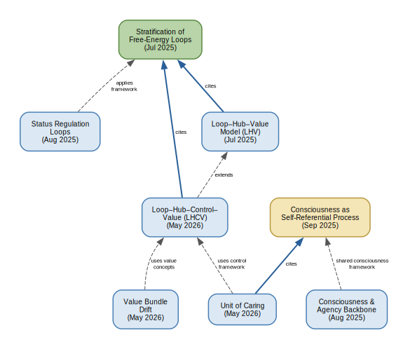

# Brain to Values

Interdisciplinary research notes, visualizations, and papers on mapping brain regions, cognitive processes, value formation, and utility. 

**Author:** Gunnar Zarncke, aintelope

## Repository layout

| Path | Contents |
|------|----------|
| [`papers/`](papers/) | LaTeX sources, built PDFs, and build scripts |
| [`viz/`](viz/) | Matplotlib diagrams (brain–value map, sensory bandwidth funnel) |
| [`requirements.txt`](requirements.txt) | Python dependencies for visualizations |

See [`viz/README.md`](viz/README.md) for figure generation and [`papers/README.md`](papers/README.md) for build commands.

## Papers

### Cross-reference graph



Solid arrows are explicit citations; dashed arrows are conceptual dependencies.
See [`papers/paper-references.dot`](papers/paper-references.dot) for the source.

### [Stratification of Free-Energy-Minimising Loops in the Vertebrate Brain](papers/free-energy-loops/free_energy_loops.pdf)

**July 2025** · [source](papers/free-energy-loops/free_energy_loops.tex)

Integrates fragmented neuroscience into a single ledger of fifteen nested optimisation loops, each minimising a distinct variational free-energy term. Orders loops by plausible evolutionary age and highlights an internal–external symmetry: for almost every interoceptive regulator there is an exteroceptive twin that reshapes the niche so sensory statistics become predictable. Serves as the empirical backbone for the hub–value models below.

### [Mechanisms of Social Status Regulation as Free-Energy Minimising Loops](papers/status-regulation-loops/status_regulation_as_free_energy_loops.pdf)

**August 2025** · [source](papers/status-regulation-loops/status_regulation_as_free_energy_loops.tex)

Applies the free-energy ledger framework to social status dynamics—from reptilian dominance reflexes to language-mediated reputation markets. For each of six status loops, specifies the free-energy term, neuroanatomical registers and actuators, and a micro-mechanism yielding prediction-error signals with neuromodulatory precision-gating.

### [From Free-Energy Loops to Human Values: Hubs as Bottlenecks](papers/loop-hub-value-model/loop-hub-value-model.pdf)

**July 2025** · [source](papers/loop-hub-value-model/loop-hub-value-model.tex)

Introduces the loop–hub–value (LHV) model: neuromodulatory hubs compress high-dimensional loop errors into low-bandwidth scalars that cortical decoders read out as human value tags. Formalises loop→hub and hub→value transfer steps, compiles an empirical hub–value map from the stratified ledger, and outlines falsifiable predictions. Includes the [brain–value schematic](papers/loop-hub-value-model/figures/brain-values-schematic.pdf) generated from [`viz/brain_values/brain.py`](viz/brain_values/brain.py).

### [From Free-Energy Loops in the Brain to Human Values](papers/loop-hub-control-value/lhcv-model-v2.pdf)

**May 2026** · [source](papers/loop-hub-control-value/lhcv-model-v2.tex)

Extends LHV to the loop–hub–control–value (LHCV) model by separating immediate control relevance proxies from developmental value readouts. Hub scalars first steer policy (attention, precision, learning rate, exploration) and are later decoded—via language, social feedback, and self-model—into stabilized value tags. Adds a three-step transfer formalism and an empirical hub–control–value map with testable predictions.

### [Selection-Channel Alignment or the Limits of Harsh Correction](papers/value-bundle-drift/value-bundle-drift.pdf)

**May 2026** · [source](papers/value-bundle-drift/value-bundle-drift.tex)

Argues that selection strength alone is insufficient for value alignment. Introduces long-horizon smoothed value bundles and reified social value artifacts to show that harsh cultural selectors can remain adaptive while drifting away from reflected moral norms—and may corrupt the machinery that would maintain alignment.

### [A Unit of Caring: Integrity Pressure, Suffering, and Cross-Scale Aggregation](papers/unit-of-caring/unit-of-caring.pdf)

**May 2026** · [source](papers/unit-of-caring/unit-of-caring.tex)

Proposes a formal scaffold for “how much is at stake” in harm, pain, and suffering. Defines integrity pressure, distinguishes it from perceived pressure and gain-modulated suffering, and introduces a global caring functional with architecture-dependent weights. Intended as a theory-neutral bridge between control-theoretic agent descriptions and cross-species ethical aggregation.

## Quickstart

```bash
pip3 install -r requirements.txt

# Regenerate a visualization
python3 viz/brain_values/brain.py
python3 viz/senses/senses.py

# Rebuild a paper
papers/loop-hub-value-model/build.sh
```
