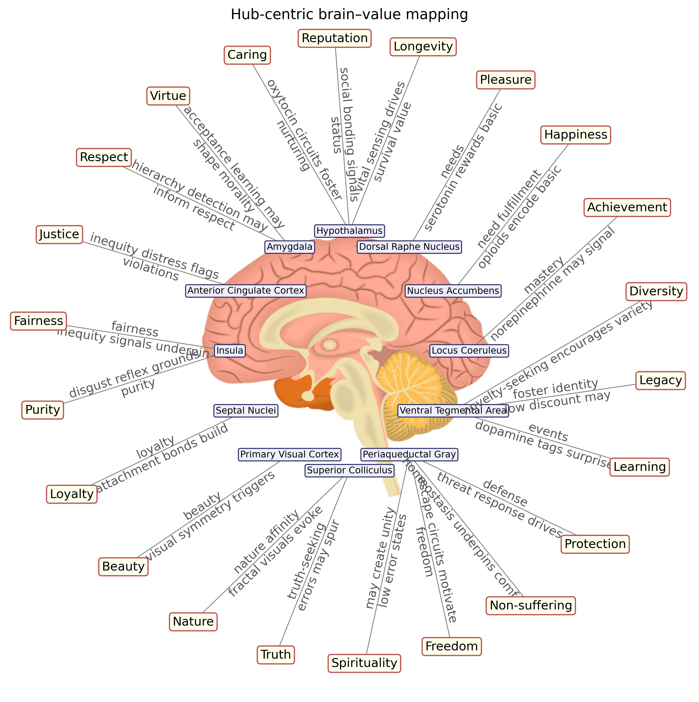
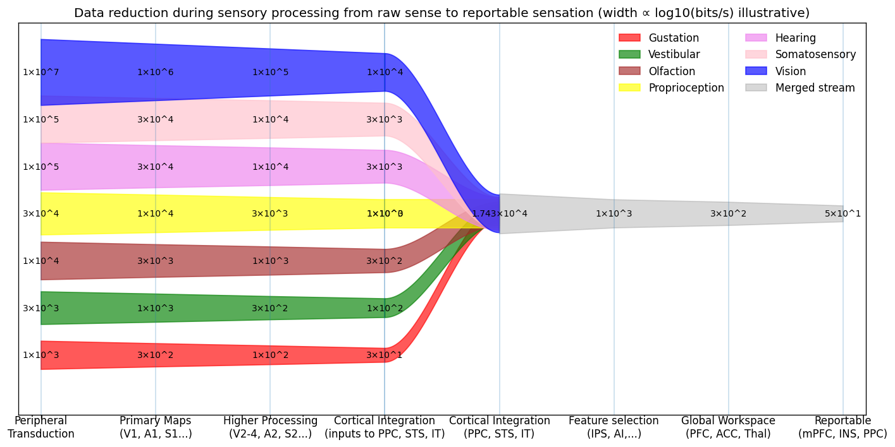

# Brain to Values

Visualizations and papers on mapping brain regions and processing stages to intrinsic human values.

## Brain–value diagram



[Open brain to values as clickable PDF](viz/brain_values/output/brain_values.pdf)

```bash
pip3 install -r requirements.txt
python3 viz/brain_values/brain.py
```

## Sensory bandwidth diagram



```bash
python3 viz/senses/senses.py
```

## Papers

| Paper | Source | PDF |
|-------|--------|-----|
| Loop–hub–value model | [papers/loop-hub-value-model/loop-hub-value-model.tex](papers/loop-hub-value-model/loop-hub-value-model.tex) | [PDF](papers/loop-hub-value-model/loop-hub-value-model.pdf) |
| Value bundle drift | [papers/value-bundle-drift/value-bundle-drift.tex](papers/value-bundle-drift/value-bundle-drift.tex) | [PDF](papers/value-bundle-drift/value-bundle-drift.pdf) |

Build a paper:

```bash
papers/loop-hub-value-model/build.sh   # also generates the brain–value schematic
papers/value-bundle-drift/build.sh
```
